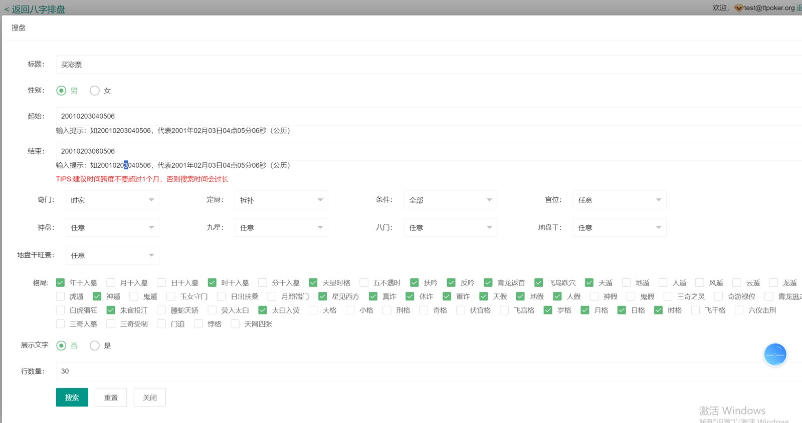
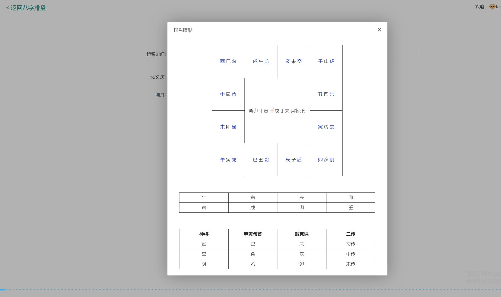
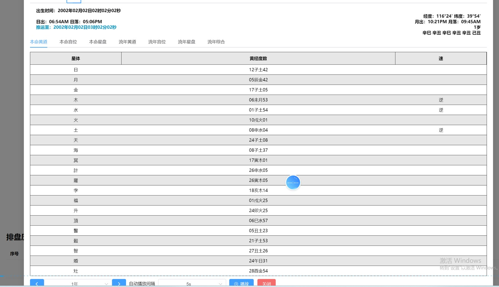
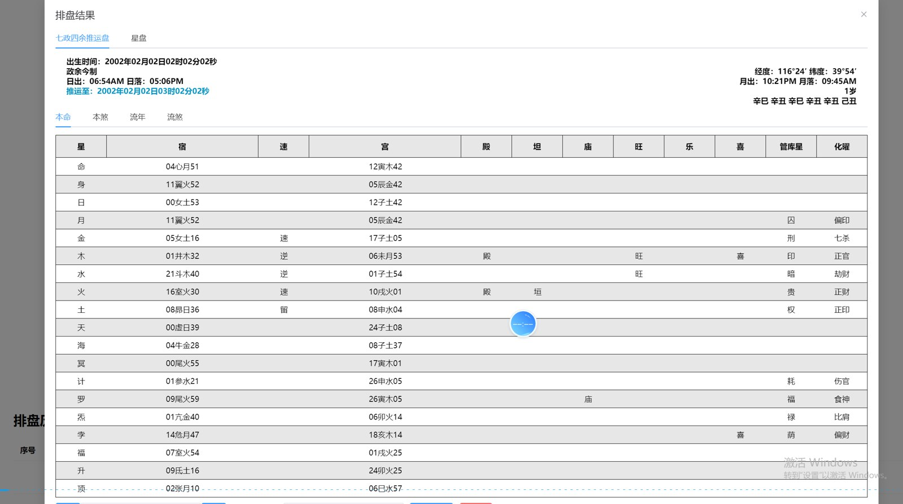

# 周易源码｜八字排盘、五行与 JavaScript 网页资料

[简体中文](README.zh-CN.md) · [繁體中文](README.zh-TW.md) · [English](README.en.md) · [产品页面](https://niubideren111.github.io/I-Ching-Divination-System/zh-cn/)

以八字排盘网页为入口的周易开发资料，包含 JavaScript 公共函数、时区处理和截图导出文件。项目还展示大六壬、流年、七政四余等页面截图，便于了解排盘类产品的界面组织。

**周易源码 · 八字排盘源码 · 易经源码 · JavaScript排盘**

## 项目重点

### 八字排盘网页

根目录 index.html 是原有排盘页面；新增产品展示页独立放在 docs，保留原功能文件。

### 网页辅助文件

common.js、utils.js、timezone.js 与 canvas2image.js 提供可阅读的网页配套资料。

### 排盘与五行设计资料

五行表格、说明文档和不同排盘界面截图支持产品设计参考。

## 资料阅读与核对方式

1. **先确认产品形态**：依次查看截图和图注，确认产品类型与可见功能流程。
2. **再核对文件证据**：直接打开下方列出的源码或文档，不只依赖功能描述。
3. **检查可构建范围**：确认准备运行的部分是否具备依赖、资源、配置和启动脚本。
4. **确认授权**：阅读仓库许可；商业素材及完整工程交付应另行取得书面授权。

## 产品截图









## 公开源码与资料

| 文件 | 说明 |
|---|---|
| [index.html](index.html) | 原有八字排盘网页 |
| [common.js](common.js) | 公共 JavaScript 文件 |
| [timezone.js](timezone.js) | 时区处理资料 |
| [canvas2image.js](canvas2image.js) | 画布图片导出文件 |
| [五行数值328.xlsx](%E4%BA%94%E8%A1%8C%E6%95%B0%E5%80%BC328.xlsx) | 五行数值表 |
| [docs/algorithm_api.md](docs/algorithm_api.md) | 已有算法接口文档 |

## 开始阅读

```bash
git clone https://github.com/niubideren111/I-Ching-Divination-System.git
cd I-Ching-Divination-System
```

## 常见问题

### 新增展示页会覆盖原排盘功能吗？

不会。产品展示页位于 docs/index.html，根目录的排盘 index.html 保留。

### 截图中的所有排盘算法都已公开吗？

当前公开入口以八字排盘页面和配套 JavaScript 为主；其他截图用于介绍产品界面范围。

## 后续资料完善方向

为每种已公开算法补输入、输出和测试样例；标明历法、时区和换日规则。不要用文化产品页面承诺预测效果。 后续更新还应加入版本化依赖清单、经过验证的构建或导入步骤、简明架构/产品流程图，以及能对应真实文件变化的版本记录。大型授权资源可放入 GitHub Releases 并提供校验值，不能提交密钥、生产地址或用户数据。

## 相关项目

- [Chess-and-Card-Game-Product-Design-Copy](https://github.com/niubideren111/Chess-and-Card-Game-Product-Design-Copy)

## 资料范围与许可

公开仓库包含八字排盘 index.html、JavaScript 文件、设计资料和多类排盘截图。截图展示范围不等于所有算法模块均已公开。 公开内容以实际文件、依赖和许可为准，不承诺搜索排名、直接上线或固定性能结果。

- Telegram: [@fox_lovemyself](https://t.me/fox_lovemyself)
- GitHub: [I-Ching-Divination-System](https://github.com/niubideren111/I-Ching-Divination-System)
